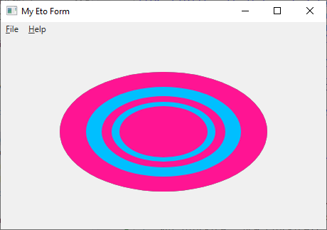

# Eto.SkiaDraw

[](https://github.com/rafntor/Eto.SkiaDraw/actions/workflows/build.yml)
[](https://sonarcloud.io/summary/new_code?id=rafntor_Eto.SkiaDraw)
[](https://www.nuget.org/packages/Eto.SkiaDraw/)
[](LICENSE)

Provides an [**Eto.Forms**](https://github.com/picoe/Eto) view control that
allows using [**SkiaSharp**](https://github.com/mono/SkiaSharp)
functionality for drawing and let Eto do the rendering.

Demo applications : https://nightly.link/rafntor/Eto.SkiaDraw/workflows/build/master

## Quickstart

Use NuGet to install [`Eto.SkiaDraw`](https://www.nuget.org/packages/Eto.SkiaDraw/), then subclass a `Eto.SkiaDraw.SkiaDrawable` and override the `OnPaint` event like in the following example:
```cs
class TestView : SkiaDrawable
{
   protected override void OnPaint(SKPaintEventArgs e)
   {
      SKColor [] colors = { SKColors.DeepPink, SKColors.DeepSkyBlue };

      for (int i = 0; i < 5; ++i)
         e.Surface.Canvas.DrawOval(Width/2, Height/2, Width/(2+i), Height/(2+i), new SKPaint() { Color = colors[i % 2], IsAntialias = true });
   }
}
```

  
